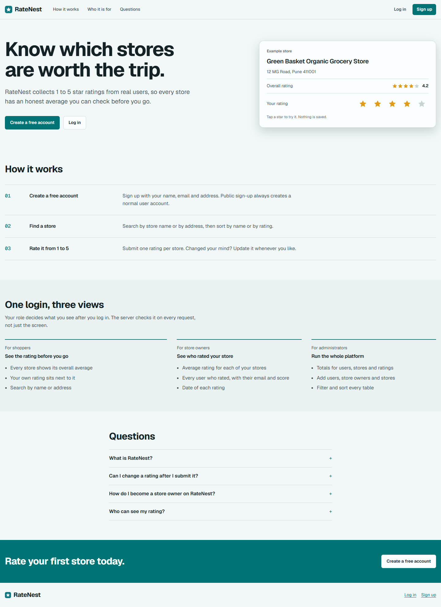
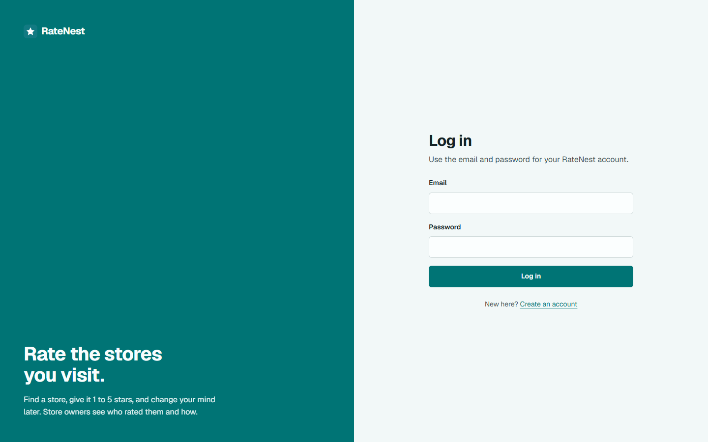
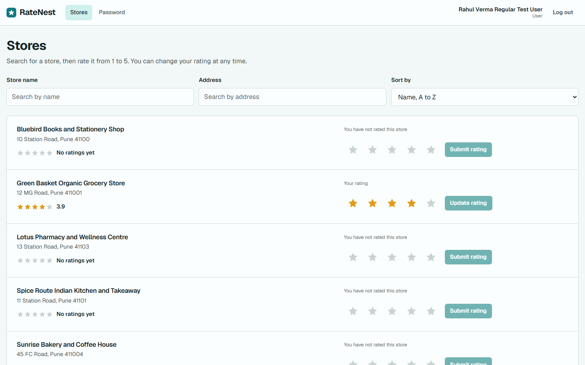
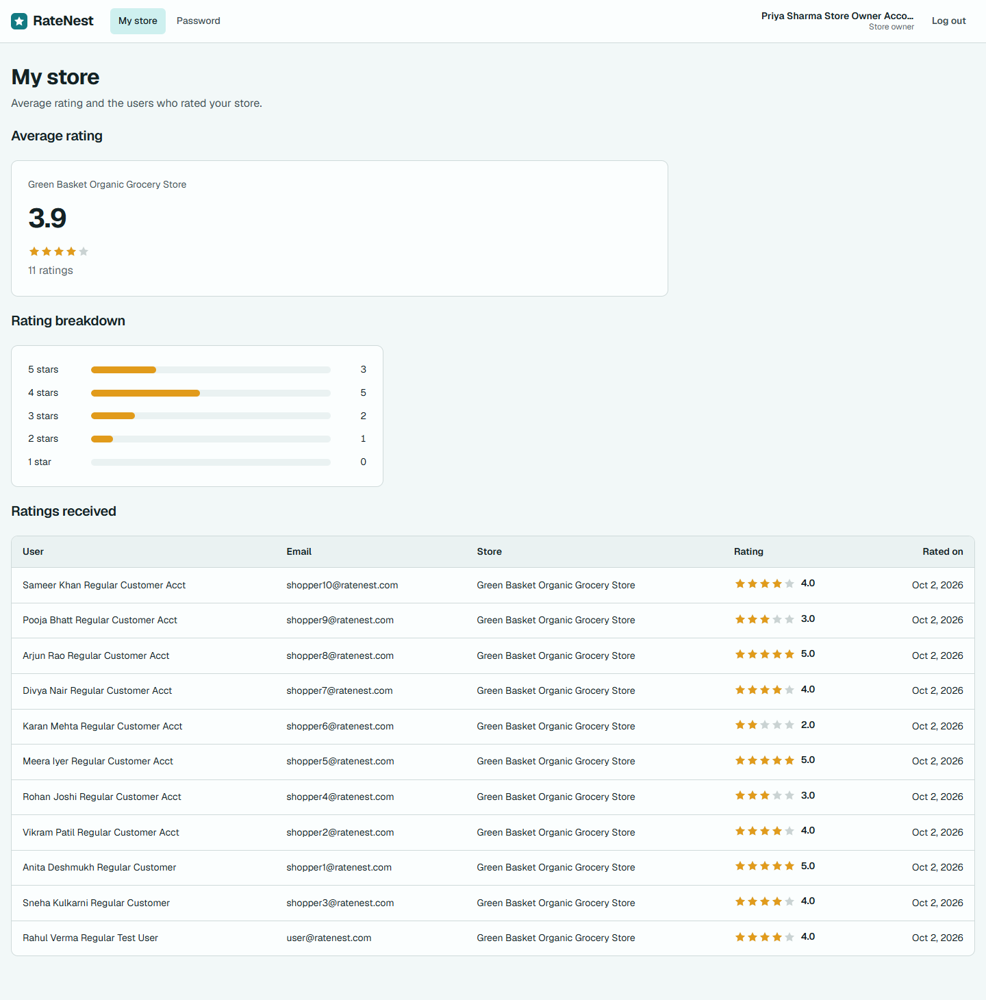
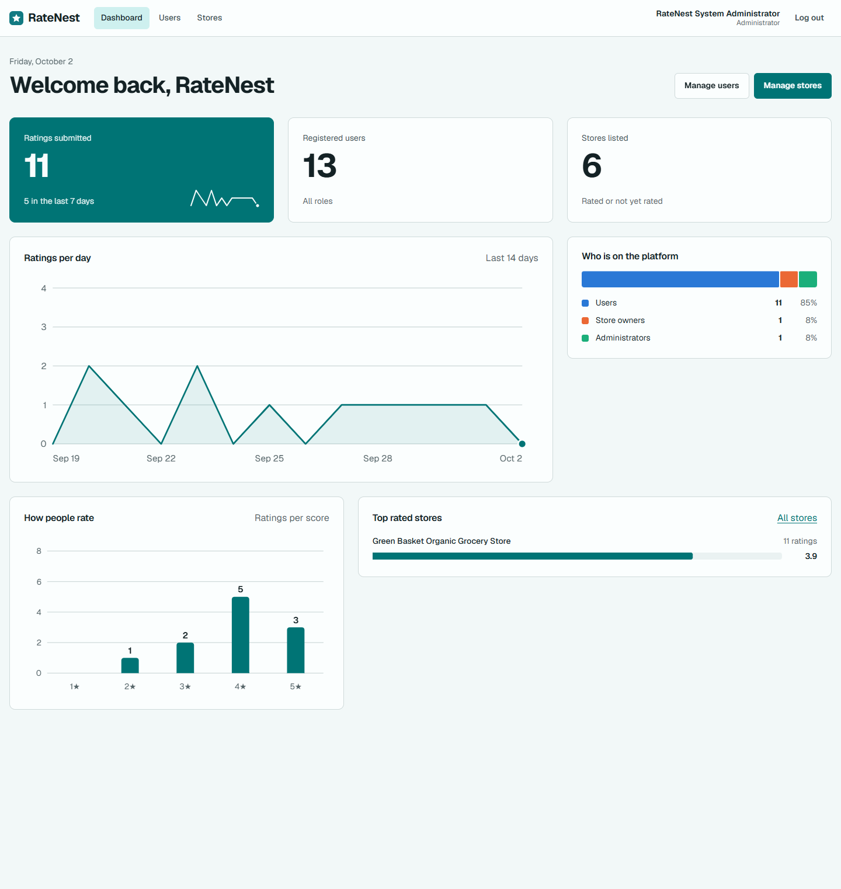
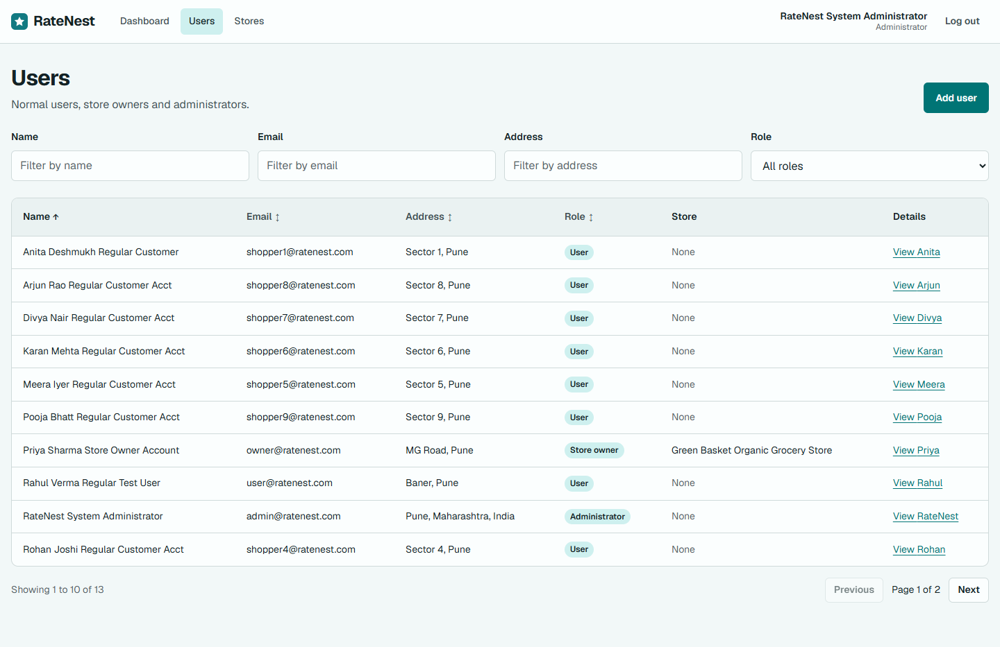
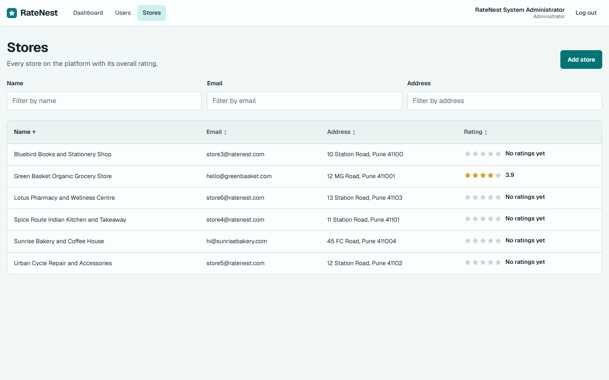

# RateNest

Full-stack store rating platform with role-based authentication and store management.

Users can find stores and rate them from 1 to 5. Store owners can view ratings and the users who rated their store. Administrators can manage users and stores.

See [PROJECT_DOCUMENTATION.md](PROJECT_DOCUMENTATION.md) for the complete project specification and implementation details.

## Stack

- Frontend: React 19, Vite, react-router-dom, plain CSS
- Backend: Node.js, Express 5, JWT, bcryptjs
- Database: MySQL (`database/schema.sql`)

## Screenshots

| Landing page | Login |
| --- | --- |
|  |  |

| Normal user: stores and ratings | Store owner dashboard |
| --- | --- |
|  |  |

| Admin dashboard | Admin users |
| --- | --- |
|  |  |



## Setup

```bash
# database: run database/schema.sql in MySQL, then
cd server
cp .env.example .env      # fill in DB_* and JWT_SECRET
npm install
node createAdmin.js       # seeds the first administrator
npm run dev               # http://localhost:5000

cd ../client
cp .env.example .env      # optional, sets VITE_API_URL
npm install
npm run dev               # http://localhost:5173
```

## Features

- Login and registration (registration always creates a normal user), change password
- Normal user: search stores by name or address, sort, submit and update a 1 to 5 rating
- Store owner: average rating and the list of users who rated their store
- Administrator: totals dashboard, add and list users and stores with filters and sorting, user details
- Landing page, toast confirmations, paginated admin tables, rating breakdown for store owners
- Role-based routing in the UI and role checks on every protected API route
